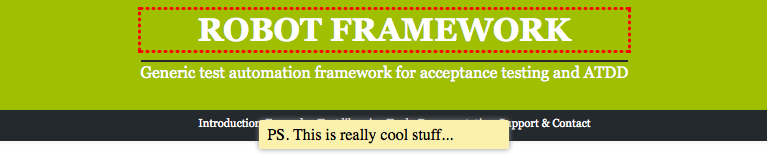

Document with an annotated screenshot
=====================================

Only sky is the limit, when `sphinxcontrib-robotframework`_ is combined with
both `robotframework-selenium2library`_ and
`robotframework-selenium2screenshots`_.

The latter provides a convenient screenshot cropping and annotating library
(originally developed for `plone.app.robotframework`_), which allows to
annotate any webpage, which includes jQuery-library, annotate it and and
capture cropped screenshot of the results.

This is how it works:

.. code:: robotframework
   :class: hidden

   *** Settings ***

   Resource  setup.robot

   Suite Teardown  Close all browsers

.. code:: robotframework

   *** Test Cases ***

   Take an annotated screenshot of RobotFramework.org
       Open browser  http://robotframework.org/  browser=${BROWSER}
       Update element style  header  margin-top  1em
       Update element style  header h1  outline  3px dotted red
       ${note1} =  Add note
       ...    header
       ...    PS. This is really cool stuff...
       ...    width=250  position=bottom
       Capture and crop page screenshot  robotframework.png
       ...    header  ${note1}

And this is how it looks:

P.S. You should look at source of this document, because this document
actually includes two ``.. code:: robotframework``-directives, but the first
one is being hidden with a magical ``:class: hidden``-option.

.. robotframework::
   :creates: robotframework.png

.. Links:
.. _sphinxcontrib-robotframework:
   http://pypi.python.org/pypi/sphinxcontrib-robotframework
.. _robotframework-selenium2library:
   http://pypi.python.org/pypi/robotframework-selenium2library
.. _robotframework-selenium2screenshots:
   http://pypi.python.org/pypi/robotframework-selenium2screenshots
.. _plone.app.robotframework:
   http://pypi.python.org/pypi/plone.app.robotframework
