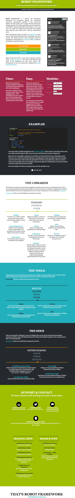

Annotated screenshots
=====================

``sphinxcontrib_robotframework`` comes with a useful webpage annotation library
(originally developed for ``plone.app.robotframework``), which allows to
annotate any webpage with jQuery-library and capture cropped screenshot of the
results.

.. code:: robotframework
   :class: hidden

   *** Settings ***

   Resource  third_setup.robot

   Suite Teardown  Close all browsers

.. code:: robotframework

   *** Test Cases ***

   Take an annotated screenshot of RobotFramework.org
       Open browser  http://robotframework.org/
       Update element style  header  margin-top  1em
       Update element style  header h1  outline  3px dotted red
       ${note1} =  Add note
       ...    header
       ...    PS. This is really cool stuff...
       ...    width=250  position=bottom
       Capture and crop page screenshot  robotframework.png
       ...    header  ${note1}

For example, the simple test case above results in a nice cropped image
below...

